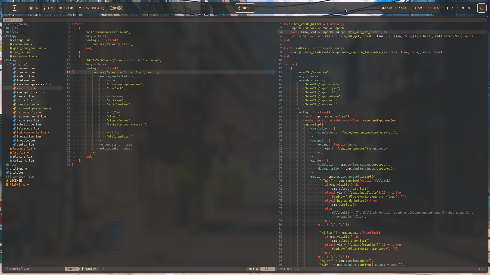
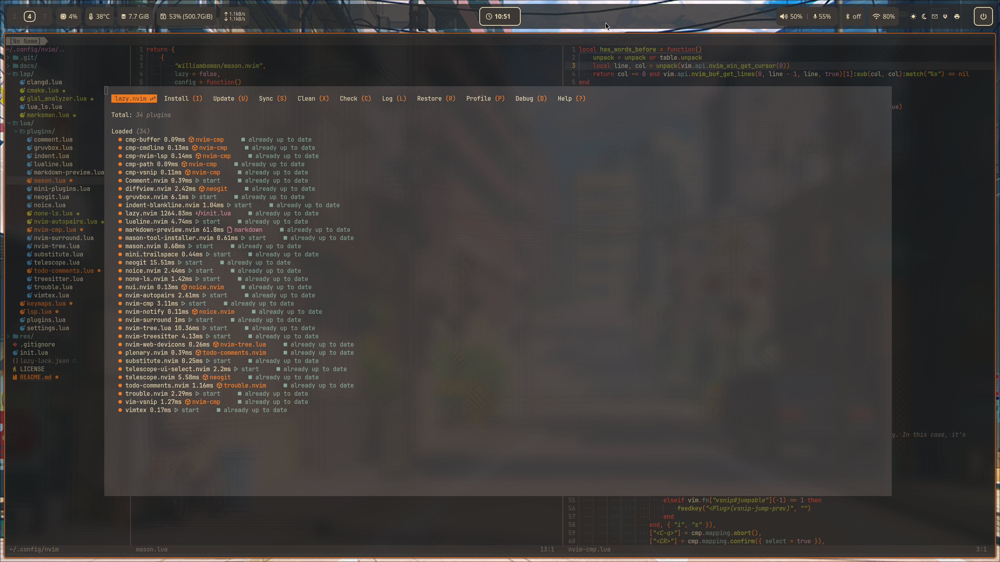

# Neovim Config

## General stuff

- My personal Neovim config
- Modular plugin integration
- Modern LSP setup (> Neovim v0.11)
- Fuzzy-Finding, Git/Diffview, File-Explorer and much more ...
- Color scheme is *Gruvbox_Dark*

## Great learning resources

- [TJ DeVries](https://www.youtube.com/@teej_dv)
- [Primegean](https://www.youtube.com/@ThePrimeTimeagen)
- [Typecraft](https://www.youtube.com/@typecraft_dev)

## Appearance

