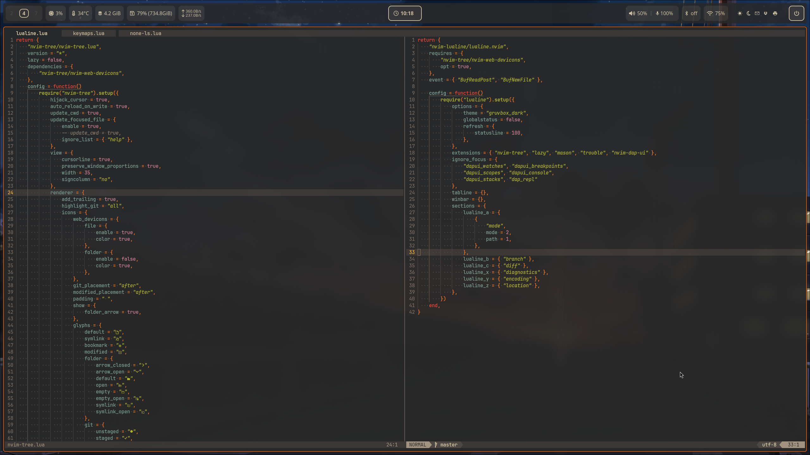
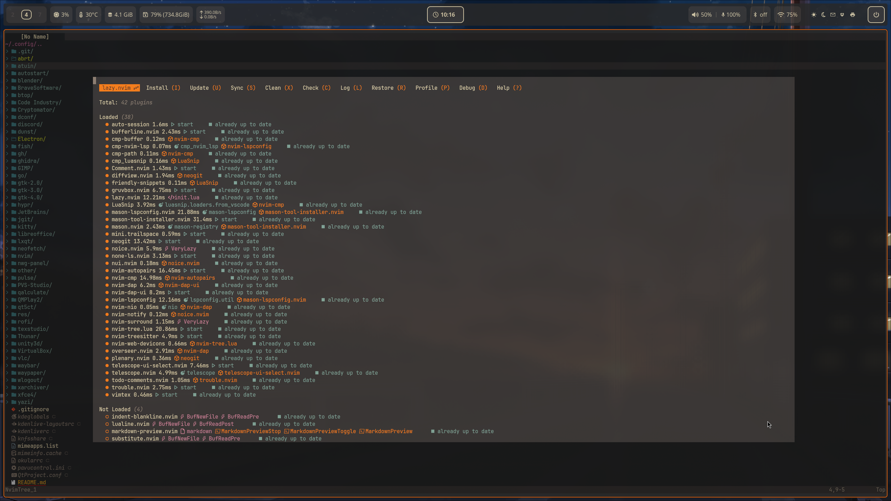

# Neovim Config

## General stuff

- Just another neovim config
- Modular plugin integration
- Covers all the basics like *lsp-integration*, *fuzzy-finding*, *git/diffview* ...
- Color scheme is *gruvbox_dark*

## Great learning resources

- [TJ DeVries](https://www.youtube.com/@teej_dv)
- [Primegean](https://www.youtube.com/@ThePrimeTimeagen)
- [Typecraft](https://www.youtube.com/@typecraft_dev)

## Appearance

