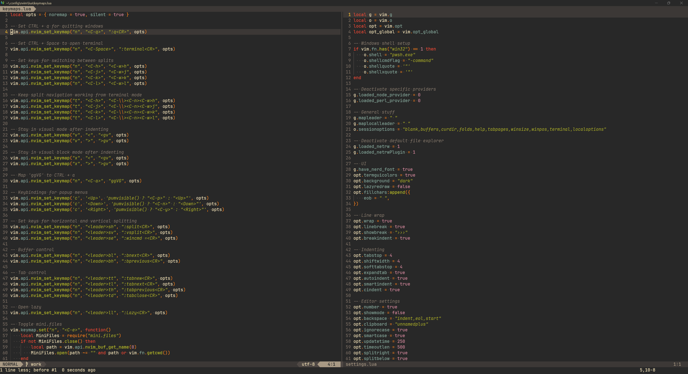
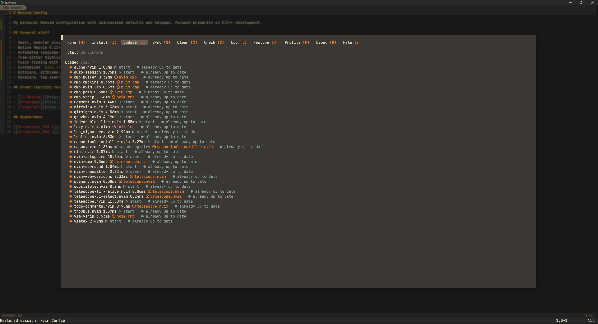
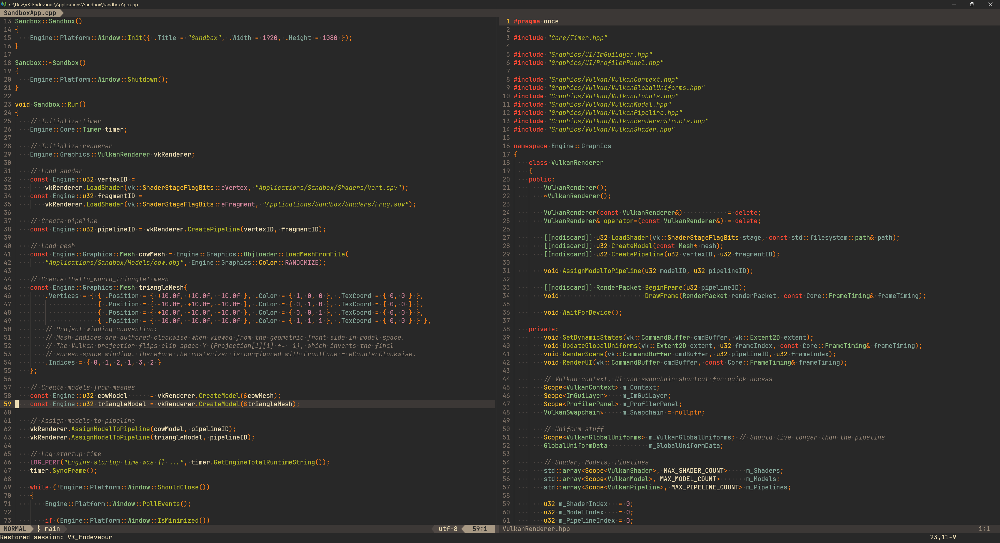

# Neovim Config

My personal Neovim configuration with opinionated defaults and keymaps, focused primarily on C/C++ development.

## General stuff

- Small, modular plugin setup powered by `lazy.nvim`
- Native Neovim 0.11+ LSP setup for C/C++, Lua, Markdown, Python, HTML, CSS, JavaScript, and more ...
- Automated language-server and formatter installation through `Mason`
- Tree-sitter highlighting, `nvim-cmp` completion, snippets, and diagnostics
- Fuzzy finding with `Telescope` and native `FZF` sorting
- Customized `mini.files` explorer with preview, Git status, bookmarks, and safe deletion
- Gitsigns, gitblame, file diffs, and file history
- Sessions, tag search, `Trouble` diagnostics, and LaTeX support with VimTeX

## Great learning resources

- [TJ DeVries](https://www.youtube.com/@teej_dv)
- [Primegean](https://www.youtube.com/@ThePrimeTimeagen)
- [Typecraft](https://www.youtube.com/@typecraft_dev)

## Appearance

